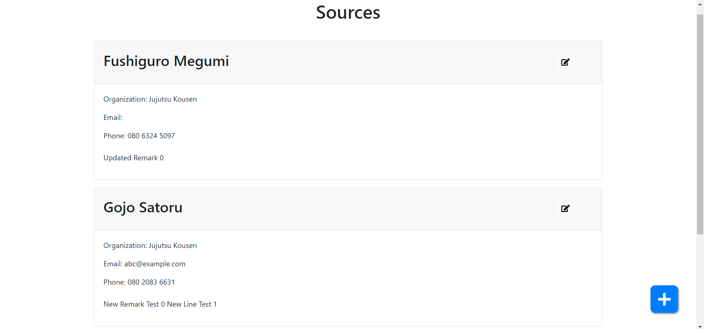
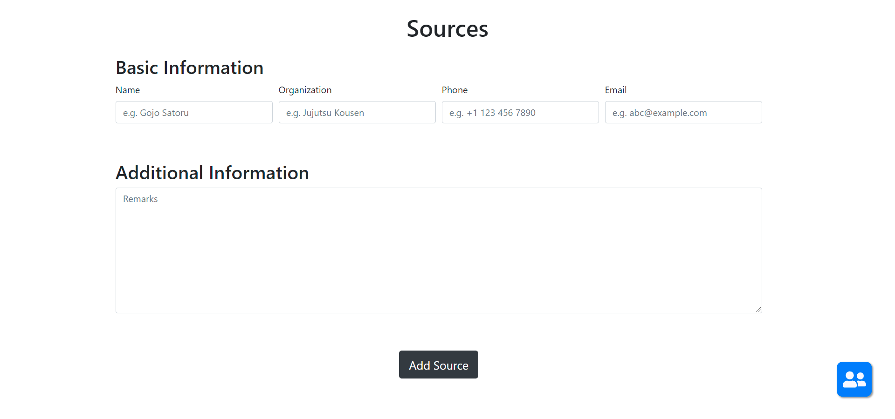
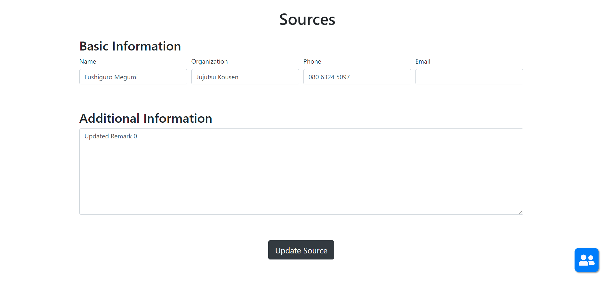
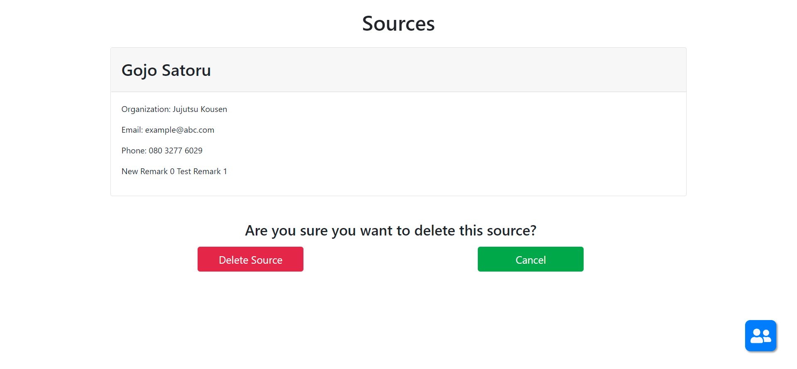

# DBProject

Due to a bug with React itself, tsconfig.json must be deleted or `npm start` won't run correctly. `npm start` will automatically create a default one, and it will run as normal.

# Screenshots

Main Page:

Add New Source:

Update Source:

Delete Source:

